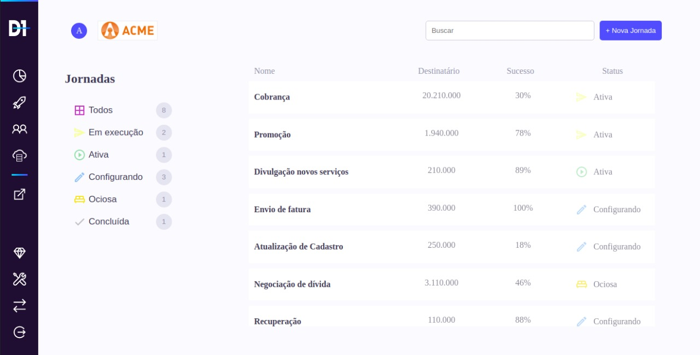

# Teste Frontend - D1 

## Como executar
- Clone o repo utilizando `https://github.com/LeoGonzaga/d-one.git`
- Após o downdload, entre na pasta do projeto.
- O projeto foi montado utilizando `yarn`, caso você também use esse gerenciador, execute `yarn`ou `npm install` para fazer o download das dependências.
- Com as dependências baixadas, basta executar `yarn start`.
- Um servidor na porta 3000 será aberto, com a aplicação rodando e consumindo a API.

## Exemplo hospedado
- Se preferir ver a execução já na internet, [clique aqui](https://d-one-teste.herokuapp.com/)

